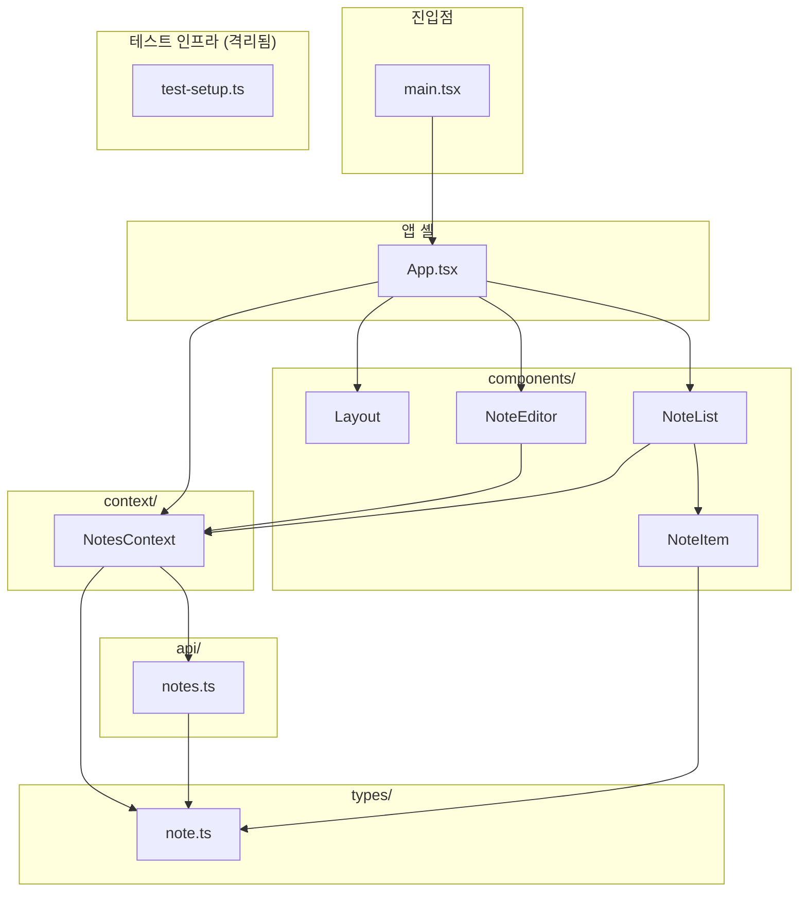

# 프로젝트 아키텍처

`src/` 의존성을 분석한 결과입니다. 화살표는 **"import (사용)" 방향**(의존하는 쪽 → 의존되는 쪽)을 의미합니다.

- 인터랙티브 버전(브라우저, 다크 테마): [`docs/architecture/index.html`](./architecture/index.html)
- 생성 방법: `mermaid-diagram` 스킬 (`src/` 스캔 → Mermaid 다이어그램 → 브라우저 시각화)

## 의존성 다이어그램



## 계층 구조

핵심 데이터 흐름은 단방향입니다:

```
main.tsx → App.tsx → NotesContext → api/notes.ts → types/note.ts
```

| 계층     | 파일                       | import 대상                                |
| -------- | -------------------------- | ------------------------------------------ |
| 진입점   | `main.tsx`                 | App                                        |
| 앱 셸    | `App.tsx`                  | NotesContext, Layout, NoteList, NoteEditor |
| 상태     | `context/NotesContext.tsx` | api/notes, types/note                      |
| API      | `api/notes.ts`             | types/note                                 |
| 타입     | `types/note.ts`            | (말단 — 의존성 없음)                       |
| 컴포넌트 | `NoteList`                 | NotesContext, NoteItem                     |
|          | `NoteEditor`               | NotesContext                               |
|          | `NoteItem`                 | types/note                                 |
|          | `Layout`                   | (로컬 의존성 없음 — 순수 합성 컴포넌트)    |

## 분석에서 확인된 사실

1. **컨벤션 준수** — 어떤 컴포넌트도 `api/notes.ts`를 직접 import하지 않습니다. 데이터 접근은 전부 `NotesContext`(`useNotes`)를 거칩니다. "컴포넌트는 직접 fetch하지 않는다"는 규칙이 실제로 지켜지고 있습니다.
2. **순환 의존성 없음** — 모든 의존성이 위→아래 한 방향으로만 흐릅니다.
3. **`types/note.ts`가 공통 말단** — Context / api / NoteItem 셋이 공유하는 타입 허브입니다.
4. **`Layout`은 완전 독립** — 슬롯(`sidebar` / `main`)만 받는 순수 합성 컴포넌트라 로컬 의존성이 0입니다.
5. **`test-setup.ts`는 격리됨** — 테스트 인프라라 그래프에서 분리해 표시했습니다.
